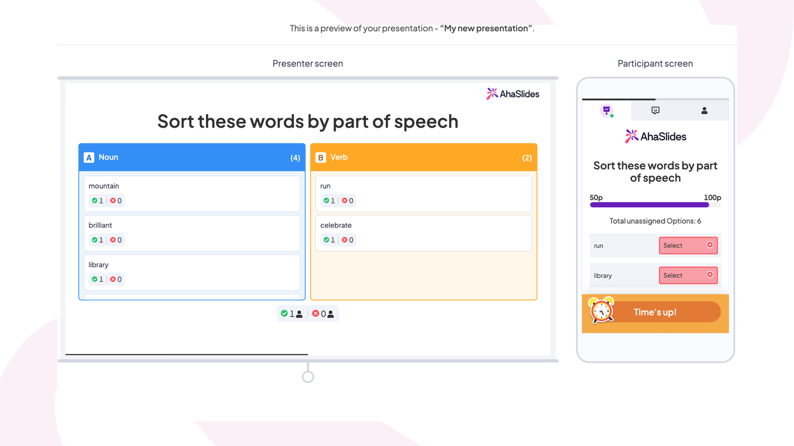
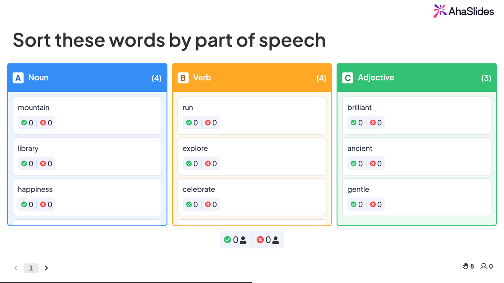

# Using the Categorise Slide

The Categorise slide turns sorting into a live quiz. Participants drag items into the right category buckets on their phones while results appear on your presenter screen in real time — no clickers, no paper, no chaos.

## How the Categorise slide works

When you present a Categorise slide, participants see a list of shuffled items on their devices. They drag each item into the category they think it belongs in. The more items they get right — and the faster they answer — the more points they earn.

On your presenter screen, you'll see the category columns with items populating in real time as responses come in.

## Setting up your Categorise slide

### 1. Add the slide

In the editor, click **New slide** (top-left) and select **Categorise** from the Quiz section of the slide type picker.

### 2. Write your question

Click into the **Your question** field in the Content panel and type the challenge you want participants to tackle. Keep it specific — they need to know exactly what they're sorting.

### 3. Add items to sort

In the **Category & options** section, enter all the items participants will sort into the shared **"Enter options, separated by commas"** field at the top. AhaSlides splits them automatically and lists them as draggable items on the participant screen.

### 4. Name your categories

Each category block (A, B, C…) has its own **"Enter category name"** field. Fill in a name for each bucket. You can add up to 8 categories by clicking **+ Add Category** at the bottom of the category list.

You can also add category-specific items by typing into the **"Enter options, separated by commas"** field inside each individual category — those items will be pre-assigned to that category as correct answers.

### 5. Adjust settings

Scroll down in the Content panel to configure scoring and timing:

- **Points** — Set the **Max** and **Min** points for this question. All correct answers receive the maximum unless "Faster answers get more points" is enabled.
- **Faster answers get more points** — Toggle this on to reward speed. For example, with 45 seconds on the clock and a max of 1,000 points, answering with 30 seconds remaining earns more than answering in the final seconds.
- **Partial scoring** — Toggle this on to award points for each correctly sorted item, even if the participant doesn't get them all right.
- **Time limit** — Set how many seconds participants have to answer. The default is 45 seconds.
- **Leaderboard** — Toggle this on to show a leaderboard slide automatically after the Categorise slide.

### Watch the tutorial


How to create a Categorise quiz slide on AhaSlides — quick tutorial (0:47)


## Previewing and presenting

Click **Preview** in the top header to rehearse the slide before going live — no participants needed. You'll see both the presenter view (category columns) and the participant view (draggable items on a phone screen).

When you're ready, click **Present**. Participants join at the access code shown on screen, and their sorted items appear live in your category columns.

## Audience experience

On the participant screen, items appear shuffled in a list. Participants tap and drag each item into the category column they think is correct. Once they've placed all items, they submit — or the timer runs out.

By using Categorise slides, you can turn any sorting task — from scientific classification to sales objection handling — into an engaging live activity that keeps your audience actively thinking, not passively watching.

## Try it: classroom template

A ready-made Categorise activity — "Sort It Out: Parts of Speech" — that you can copy straight into your own account. Students sort 11 words (mountain, run, brilliant, and more) into Noun, Verb, and Adjective buckets in real time.

<a href="https://presenter.ahaslides.com/share/sort-it-out-parts-of-speech-classroom-categorise-activity-1781516241606-55jdubirlh" target="_blank" rel="noopener" style="display:inline-flex;align-items:center;background:#6A1EBB;color:#fff;padding:0 24px;height:44px;border-radius:8px;font-family:'Plus Jakarta Sans',sans-serif;font-size:16px;font-weight:600;text-decoration:none;">Use this template →</a>

## Common use cases

The Categorise slide works wherever sorting or grouping reveals knowledge — here are some of the most common contexts:

- **Classroom and education**
  Ask students to sort vocabulary words by grammatical category, classify organisms into kingdoms, or group historical events by era. The live results let teachers immediately spot where the class is solid and where a concept needs revisiting.

- **Corporate training and onboarding**
  Have new hires sort company values into "strategic priority" or "cultural pillar" buckets, or ask trainees to classify customer complaints by support tier. It turns a passive compliance session into a check that knowledge has actually landed.

- **Team workshops and retrospectives**
  Sort a backlog of improvement ideas into "quick win", "big bet", and "park for later" buckets, or group team blockers by root cause. The shared screen makes the grouping visible to everyone, making it easier to reach alignment quickly.

- **Icebreakers and events**
  Sort fun facts, team trivia, or product features into themed categories to warm up a conference session or kick off an all-hands. Because the items are shuffled and the timer adds pressure, even simple sorting challenges become surprisingly energetic.

- **Market research and customer sessions**
  Ask participants to sort product attributes into "must-have", "nice-to-have", and "not needed" columns, or group use cases by department. The live category totals give instant, unfiltered signal on how your audience thinks about your product.

*Last updated: 2026-06-23*
